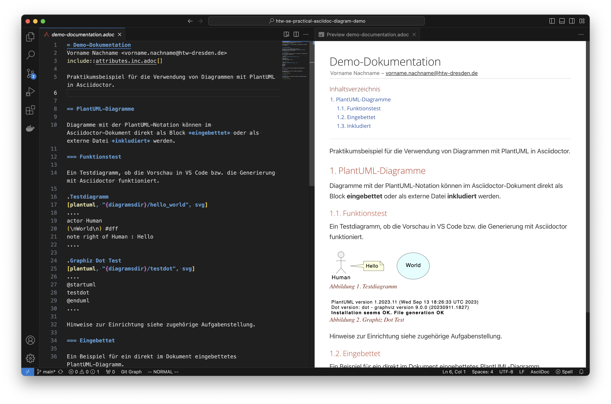

# Demo-Dokumentation

Praktikumsbeispiel für die Demonstration der Verwendung von Diagrammen mit PlantUML in Asciidoctor.

### Hinweise zur Vorschau der Diagramme in Visual Studio Code

Sind die benötigten Asciidoctor Tools ([Installationsanleitung](https://www.informatik.htw-dresden.de/~zirkelba/notes/se/asciidoc-installation-and-configuration/)) nicht lokal installiert, kann die Vorschau in Visual Studio Code für die Anzeige der PlantUML-Diagramme wie folgt angepasst werden:

1. Folgend Einstellungen unter Preferences (oder Zahnradsymbol) -> Settings -> Extensions -> asciidoc in Visual Studio Code setzen bzw. aktivieren:

    * Asciidoc: **Use_asciidoctor_js**: :white_check_mark: (aktiviert)
    * Asciidoc: **Use_kroki**: :white_check_mark: (aktiviert)

2. Visual Studio Code ggf. neustarten!

